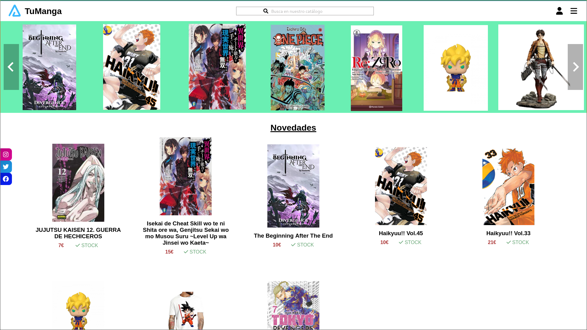

<h1 style="display:flex;width=100%;justify-content:center;align-items:center;gap: 15px"> TuManga</h1>

## URL

[tumanga.arnaizdev.com](https://tumanga.arnaizdev.com)

## Technologies

### Frontend


### Backend


### Others


## Description

This project consist in a online store that sells Mangas and Merchandising of anime. I created this project for the TFG of the Superior Grade.

In this project I used the technologies mentioned in the top. 
The backend consist in an API REST that I created in Javascript. This is the best language that I know.
For the frontend I used React because in this moment I wasn't know NextJS.


## Project structure 

```
$PROJECT_ROOT
│   # Backend project files
├── backend
│   # Frontend project files
├── tumanga
│   # Preview image
├── images-doc
│   # HTML - CSS layout
└── layout
```

## Future feature

- Add the swagger docs


## Preview




## License

MIT License.

You can create your own online store by forking this project with this conditions:

- Add a link to [my store](https://tumanga.arnaizdev.com)

Check out [License](./License.md) for more detail.


## Download the project

If you want to work with the project in your local:

- Clone the project
	- https://github.com/Arnaiz23/TuManga.git
- cd backend
	- npm run dev (if you want to work with nodemon)
	- npm start
- cd tumanga
		- npm start
